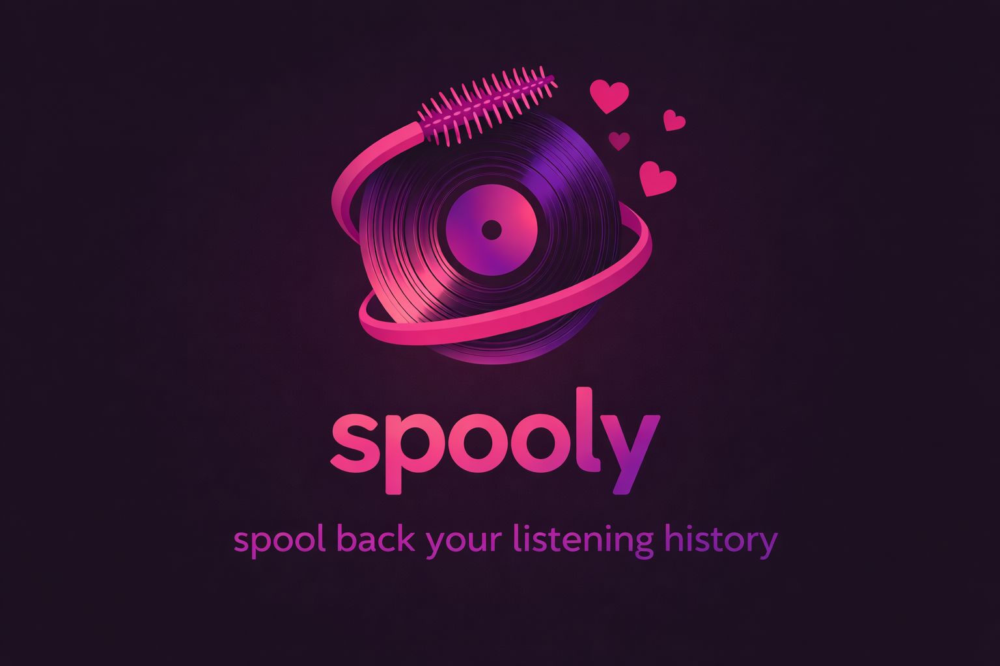

<p align="center">
   
</p>

<h1 align="center">Spoolify</h1>
<p align="center"><em>spool back your listening history</em></p>

---

<p align="center">
   <b>Spoolify</b> (aka <b>Spooly</b>) converts your Spotify Extended Streaming History JSON into a fast, queryable SQLite database. Designed for speed, privacy, and reproducibility—no Spotify API required.
</p>

<p align="center">
   Use it as a <b>CLI tool</b> for local workflows or run it as a <b>web API</b> with FastAPI.
</p>

---

## ⚡ Features

- Import Spotify Extended Streaming History JSON (file or directory)
- Local SQLite storage
- Idempotent inserts (no duplicates)
- High-performance bulk insert
- CLI analytics commands (stats, top artists/tracks, monthly/yearly/hourly, trends, wrapped)
- Read-only FastAPI web API for dashboards, scripts, and integrations
- No API or account required

---

## 🚀 Usage

### CLI Mode

Run commands directly with `main.py`:

```sh
python main.py import <path_to_json_or_directory>
```

Or use the unified entrypoint:

```sh
python entrypoint.py <cli-command>
```

Common commands:

```sh
python main.py import "C:/path/to/Spotify Extended Streaming History"
python main.py stats
python main.py top-artists
python main.py top-tracks
python main.py monthly
python main.py yearly
python main.py hourly
python main.py trends
python main.py insights
python main.py wrapped --year 2025 --json
```

Examples:

```sh
python main.py import "Streaming_History_Audio_2025-2026_10.json"
python entrypoint.py import "C:/Users/nonadmin_reidan/Downloads/Spotify Extended Streaming History"
```

Example output:

```
Inserted: 7504
Duplicates skipped: 0
Total rows in database: 7504
```

### Web API Mode

Start the API server:

```sh
python entrypoint.py serve
```

Optional environment variables:

```env
SPOOLIFY_API_HOST=0.0.0.0
SPOOLIFY_API_PORT=8000
```

Useful URLs after startup:

- API base: `http://localhost:8000`
- Onboarding UI: `http://localhost:8000/`
- Swagger docs: `http://localhost:8000/docs`
- ReDoc: `http://localhost:8000/redoc`

Main endpoints:

- `GET /health`
- `GET /stats`
- `GET /top-artists?limit=10`
- `GET /top-tracks?limit=10`
- `GET /monthly`
- `GET /yearly`
- `GET /hourly`
- `GET /trends`
- `GET /wrapped?year=2025`
- `POST /onboarding/validate-archive`
- `POST /onboarding/import`
- `POST /onboarding/validate-archive-zip`
- `POST /onboarding/import-zip`

See full API details in `docs/API.md`.

### Frontend Onboarding (Phase 7 Start)

When API mode is running, open the onboarding page in your browser:

```sh
http://localhost:8000/
```

The page helps you:

- request and prepare Spotify Extended Streaming History
- validate archive file/folder structure before import
- validate and import the delivered ZIP archive directly
- import in either `historical_backfill` or `ongoing_sync_prep` mode
- review Spotify Developer app prerequisites for future sync phases
- keep a privacy-first, local-first setup

---

## 🛠️ Environment Setup

Spoolify uses a `.env` file for configuration. See `.env_example`:

```
SPOOLIFY_DB_FILE=spoolify.db
SPOOLIFY_API_HOST=0.0.0.0
SPOOLIFY_API_PORT=8000
```

Copy `.env_example` to `.env` and adjust as needed:

```sh
cp .env_example .env
# or manually create/edit .env
```

---

## ⚡ Performance

- ~166,000 plays imported in ~14 seconds (~11,700 rows/sec)
- Local-first, no network required

Example (Windows PowerShell):

```
Measure-Command { python main.py import "C:/Users/nonadmin_reidan/Downloads/Spotify Extended Streaming History" }

Days              : 0
Hours             : 0
Minutes           : 0
Seconds           : 13
Milliseconds      : 923
Total play count  : 166,140
```

---

## 🧪 Performance Testing

- Configure your import directory in `tests/tests.json`:
   ```json
   {
      "import_dir": "C:/Users/nonadmin_reidan/Downloads/Spotify Extended Streaming History"
   }
   ```
- Run the test script:
   ```powershell
   ./tests/perf_import.ps1
   ```
- Uses a temporary test database and cleans up after the run
- Prints all import output and errors in the summary

---

## 🔌 API Dependencies

CLI mode works with the standard library.

API mode requires:

```sh
pip install fastapi uvicorn python-multipart
```

---

## 📁 Project Structure

```
Spoolify/
├── entrypoint.py
├── api.py
├── query_data.py
├── main.py
├── db.py
├── queries.py
├── importer.py
├── tests/
│   ├── perf_import.ps1
│   └── tests.json
├── docs/
│   ├── API.md
│   └── img/
│       └── logo.png
├── .env_example
├── ROADMAP.md
└── README.md
```

---

## 📝 Notes

- No Spotify API or account required
- Local database, privacy-first
- Reliability and reproducibility focused

---

## ⚠️ Disclaimer

Spoolify is not affiliated with Spotify AB or any of its subsidiaries.

---

## 🛣️ Roadmap

See [ROADMAP.md](ROADMAP.md) for upcoming features and development plans.
